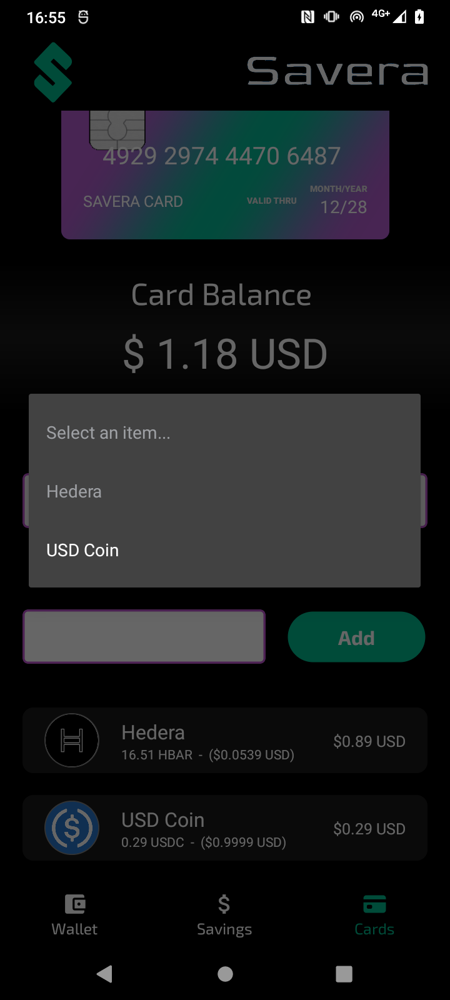
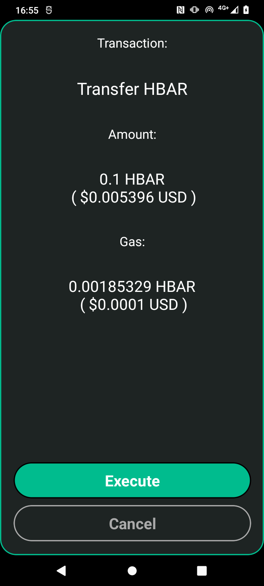

# Savera

## Fast Links:

WALLET CODE: [CODE](./Savera/)

PLAYSTORE: [LINK](https://play.google.com/store/apps/details?id=com.altaga.savera)

VIDEO DEMO: [VIDEO](https://youtu.be/APm5rPMn-Kg)

# Trials in Businesses

VIDEO in a real business: [VIDEO](https://youtu.be/w2WL8tunOlk)

NON-EDITED VIDEO: [VIDEO](https://youtu.be/UTTW62M5JV4)

# System Diagrams:

- Main Account: Within the schematics you can see that we have our main wallet, which is a Non Custodial Wallet, to which you will have to save its mnemonic at the time of its creation. Like all wallets on the market, creating your wallet is free, however you will have to pay fees for creating the savings account and the card account.

- Savings Account: This wallet, like the previous one, is a Non Custodial Wallet, which will save the savings on each transaction according to the chosen savings protocol.

- Card Account: This wallet, the same as the previous one, is a Custodial Wallet, this, unlike being controlled through the Main Account, is controlled through the hash of the card that is merged when the account is created.

# Introduction:

Savera is a blockchain wallet and platform that empowers undeserved communities through saving. Employing novel Blockchain technologies through Hedera such as predictable fees and optimized savings. It also combines it with TradFi via seamless card payments.

## React Native Implementation:

During the hackathon we noticed that support for the React Native framework was not implemented correctly as it required the installation of an additional framework called [Expo](https://expo.dev/). However, we achieved the implementation in pure React Native projects by using a [Native NodeJS Server](https://github.com/nodejs-mobile/nodejs-mobile-react-native) running in parallel.

In addition, by having a NodeJS server in parallel, we have the entire crypto module without needing to use React Native alternatives, thus lightening the weight of the App and improving the user experience when downloading the Wallet.

All technical implementations for this tab are included here.

- [CODE](./Savera/nodejs-assets/nodejs-project/main.js)

## Wallet:

Our main screen is our Main Account, which is a traditional wallet to manage our assets. All balances are in **Mainnet** and the code for this screen is as follows. 

In the case of Hedera, all the tokens that we want in our wallet will have to be associated from the main wallet. The cost per token association is $0.05 USD (updated 08/18/2024)

 

All technical implementations for this tab are included here.

- [CODE](./Savera/src/screens/main/tabs/tab1.js)

## Send:

This screen is important and allows us to make simple or batch transfers from our wallet. And the code for this screen is the following. 

 

It should be remembered that if the Savings account is active, one more transaction will be added to the final transfer to our savings account. All this is very easy to do with Hedera, even if Visa is one of its clients. [2](#references).

All technical implementations for this tab are included here.

- [CODE](./Savera/src/screens/sendWallet/sendWallet.js)

## Receive:

With this screen, you can easily show your Wallet to receive funds, whether Hedera or Any Token.

User Interface Fun Fact: To maintain the compatibility of wallets like Blade Wallet with our app, it was necessary to round the edges of the QR code in this section, since if the edges are not rounded these wallets will not read the AccountId.

All technical implementations for this tab are included here.
- [CODE](./Savera/src/screens/depositWallet/depositWallet.js) 

## Payment: 

In this tab we intend to make it the same as using a traditional POS, this allows us to enter the amount to be charged in USD and to be able to make the payment with one of our virtual cards. And this is the function code: 

  

All technical implementations for this tab are included here.
- [CODE](./Savera/src/screens/paymentWallet/paymentWallet.js)
- [WITHDRAW FROM CARD](./Cloud%20Functions/WithdrawCard.js)

## Savings:

The savings account is a Non Custodial Wallet which allows us to have savings based on protocols. We will explain these protocols a little later. However, on this screen you can withdraw the savings according to the defined date and the code on this screen is the next. 

  

All technical implementations for this tab are included here.
- [CODE](./Savera/src/screens/main/tabs/tab2.js)

### Savings Protocol:

- Balanced Protocol, this protocol performs a weighted rounding according to the amount to be paid in the transaction, so that the larger the transaction, the greater the savings, in order not to affect the user. And this is the function code:

        export function balancedSavingToken(number, usd1, usd2) {
            const balance = number * usd1;
            let amount = 0;
            if (balance <= 1) {
                amount = 1;
            } else if (balance > 1 && balance <= 10) {
                amount = Math.ceil(balance);
            } else if (balance > 10 && balance <= 100) {
                const intBalance = parseInt(balance, 10);
                const value = parseInt(Math.round(intBalance).toString().slice(-2), 10);
                let unit = parseInt(Math.round(intBalance).toString().slice(-1), 10);
                let decimal = parseInt(Math.round(intBalance).toString().slice(-2, -1), 10);
                if (unit < 5) {
                unit = '5';
                decimal = decimal.toString();
                } else {
                unit = '0';
                decimal = (decimal + 1).toString();
                }
                amount = intBalance - value + parseInt(decimal + unit, 10);
            } else if (balance > 100) {
                const intBalance = parseInt(Math.floor(balance / 10), 10);
                amount = (intBalance + 1) * 10;
            }
            return new Decimal(amount).sub(new Decimal(balance)).div(usd2).toNumber();
        }

- Percentage protocol, unlike the previous protocol, this one aims to always save a percentage selected in the UI.

        export function percentageSaving(number, percentage) {
            return number * (percentage / 100);
        }

All technical implementations for this tab are included here.
- [CODE](./Savera/src/utils/utils.js)

## Cards:

Finally, in the cards section, we can create a virtual card, which will help us make payments without the need for our wallet directly with a physical card in any POS terminal with Savera. And the code for this screen is the following. 

  

All technical implementations for this tab are included here.
- [CODE](./Savera/src/screens/main/tabs/tab3.js)
- [ADD CARD](./Cloud%20Functions/AddCard.js)

# References:

1. https://blog.quicknode.com/Hedera-network-quicknode-solving-blockchain-challenges-with-scalability-to-move-web3-towards-widespread-adoption/
2. https://hederafoundation.org/use-cases/defi
3. https://hedera.com/use-cases/payments
4. https://medium.com/@idoexist99/Hedera-the-speedy-new-blockchain-built-for-cool-dapps-2f39c55f8d56
